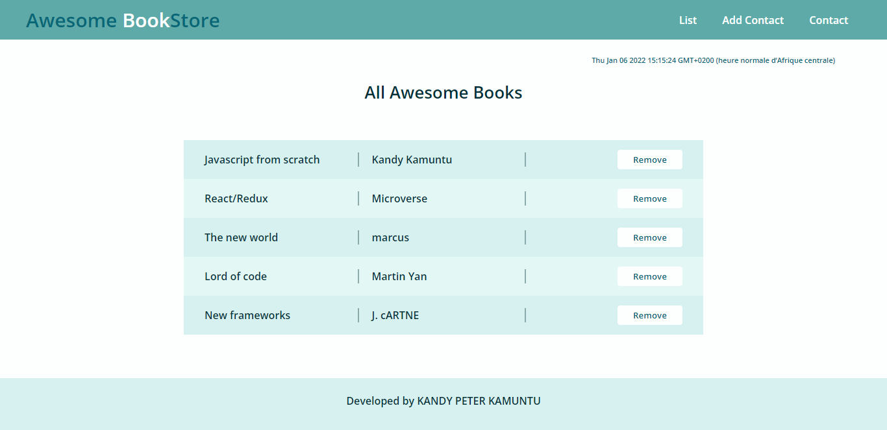

# awesome-book-ES6
create an awesome book javscript app using ES6 syntax and packages managments. I use `luxon` package to get the date.

This is a screenshot of my awesome book

## Built With

- HTML
- CSS
- Javascript
- npm
- luxon

### Prerequisites

clone repo: `git clone git@github.com:Kandy-Peter/ES6-awesome-book.git`

### Live demo

see the live demo [Awesome Book](https://kandy-peter.github.io/ES6-awesome-book/)

### Install

 run `npm install` to install dependencies.
 run `npm i --save luxon` to install luxon.

## Command

These commands are here to help you for how to check errors in your code using Linter

*to install the webhint run `npm init -y` to initialize the package and create `package.json`

 then run `npm install --save-dev hint@6.x`
 After creating the `.hintrc` file, run `npx hint .` to ckeck if there's an error.

*to install the stylelint that help you to avoid errors in styles code run:
    `npm install --save-dev stylelint@13.x stylelint-scss@3.x stylelint-config-standard@21.x stylelint-csstree-validator@1.x`
 Then run `npx stylelint "**/*.{css,scss}"` after creating a `.stylelint.json` file

* To install Eslint run `npm install --save-dev eslint@7.x eslint-config-airbnb-base@14.x eslint-plugin-import@2.x babel-eslint@10.x`
And to fix lint errors run `npx eslint .`

## Authors

👤 **Kandi Peter**

- GitHub: [Kandi-Peter](https://github.com/Kandy-Peter)
- LinkedIn: [Kandi-Kamuntu](https://www.linkedin.com/in/kandi-peter-a49590212/)
- twitter: [Kandi_Peter](https://twitter.com/peter_kandy)

